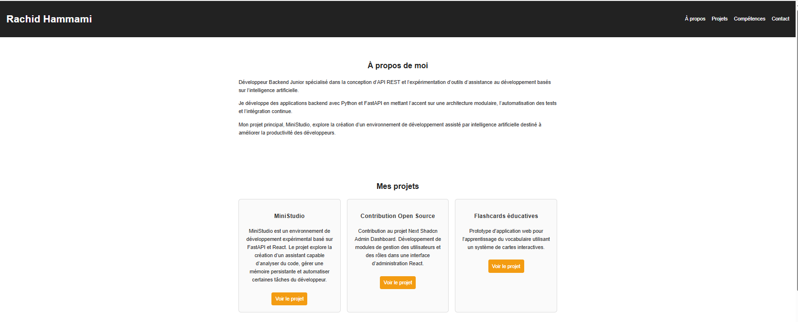

# 🌐 Portfolio — Rachid Hammami

Portfolio personnel présentant mes projets et expérimentations en développement backend.

👉 https://rachid-hammami.github.io/portfolio

---

## 👨‍💻 Profil

**Développeur Backend Junior — API REST — Outils IA**

Je m'intéresse particulièrement :

- à la conception d'API REST
- aux architectures backend modulaires
- aux outils d'assistance au développement basés sur l'IA

---

## 🛠 Technologies

---

## 🚀 Projets présentés

### MiniStudio

Environnement expérimental de développement basé sur **FastAPI et React**.  
Le projet explore la création d'un assistant capable d'analyser du code, gérer une mémoire persistante et automatiser certaines tâches du développeur.

### Contribution Open Source

Participation au projet **Next Shadcn Admin Dashboard** avec développement de modules de gestion des utilisateurs et des rôles.

### Flashcards éducatives

Prototype d'application web pour l'apprentissage du vocabulaire à l'aide d'un système de cartes interactives.

---

## 📸 Aperçu

---

## 📬 Contact

📧 anzaikun@gmail.com  

🔗 https://github.com/rachid-hammami

---

*Ce portfolio évolue régulièrement avec de nouveaux projets et expérimentations.*
